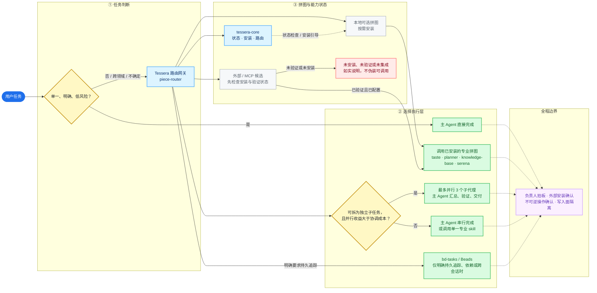

<div align="center">

# 🧩 Tessera

**面向个人项目的能力操作系统**
一个 Git 仓库,把 Claude Code / Codex 的可复用能力组织成「能力拼图」,按需拼装。

[](https://github.com/gloamere/Tessera/actions/workflows/ci.yml)
[](https://github.com/gloamere/Tessera/releases)


[](LICENSE)

</div>

---

> **Tessera** —— 马赛克镶嵌块。每一块能力是一片 tessera,按需拼装成你的工作流,不要求每个项目都走完整流程。适合软件开发、游戏私服、策划、调研与 UI 协作。

核心是一个**零第三方依赖的 Go 单二进制** `tessera`:能力市集安装器、项目脚手架、状态体检工具,全部收在一个可执行文件里。项目的事实、决策与研究仍留在项目自己的 Markdown 里;拼图只负责组织与执行辅助。

## 🗺️ 最新执行流程



这张图表达的是当前行为，而非路线图承诺：候选后端或 MCP 只有在完成安装与验证后才会进入执行层；否则路由网关保留透明降级路径。

## 🧩 默认拼图清单

下列 6 块拼图默认出现在 Tessera 市集；“默认提供”不等于静默安装。除 `tessera-core` 外，其余拼图均按项目需要安装和启用。

| 拼图 | 类型 | 解决什么问题 | Codex 状态 | 额外条件 |
|---|---|---|---|---|
| `tessera-core` | Skill | 模糊任务路由、安装引导、状态查看 | 原生支持 | 无 |
| `bd-tasks` | CLI wrapper | 持久任务、依赖图、跨会话跟进 | 原生支持 | 仅明确需要时使用；需 `bd`/Beads |
| `taste` | Skill | UI、视觉、排版与文案的审美评审 | 原生支持 | 无 |
| `knowledge-base` | Skill | Markdown 笔记、双链、知识沉淀与索引 | 原生支持 | 无 |
| `planner` | Skill | 游戏、内容与产品方案的策划和拍板材料 | 原生支持 | 无 |
| `serena` | MCP server | 符号级检索、引用查找与跨文件重构 | MCP 支持 | 需 `uv`、Serena 安装及 MCP 注册 |

外部候选如 `superpowers`、`agent-reach`、Playwright MCP、GitHub MCP 不属于默认拼图。它们只有在对应平台安装方式得到验证、并由用户确认后才会进入工作流。

## 🛠️ 当前功能总览

### 面向使用者

| 功能 | 入口 | 行为 |
|---|---|---|
| 任务路由 | 自然语言提出复杂或跨领域任务 | `piece-router` 在直接执行、专业拼图、条件子代理与透明降级之间选择 |
| 专业能力调用 | UI 评审、知识整理、方案策划、持久任务、语义代码理解 | 调用已安装且收益明显高于额外 token/等待成本的拼图 |
| 条件子代理 | 可拆分的复杂任务 | 宿主支持时最多并行 3 个独立子任务；主 Agent 负责汇总、验证和交付 |
| 拼图安装 | “安装拼图”或 `tessera setup` | 展示可选能力与依赖；外部安装必须经用户确认 |
| 环境状态 | “tessera status” | 查看已安装拼图、版本和外部依赖状态 |
| 项目初始化 | `tessera init --target <path>` | 只补缺地创建项目知识库与决策骨架，不覆盖已有文件 |

### 面向维护者

| 功能 | 命令 | 用途 |
|---|---|---|
| 市集注册与安装 | `codex plugin marketplace add ./`、`codex plugin add <piece>@tessera` | 让 Codex 读取本地 Tessera 拼图 |
| 拼图清单 | `tessera piece list` | 查看本地拼图及其外部依赖声明 |
| 环境体检 | `tessera doctor` | 检查仓库和安装环境 |
| 安全门/自检 | `tessera gate`、`tessera selftest` | 兼容现有门策略与内置断言 |
| 版本更新 | `tessera update` | 下载、校验并替换 CLI 二进制 |

## ✨ 特性

| | |
|---|---|
| 🧩 **能力拼图** | skills / 插件 / 安装规则组织成可按需拼装的 piece;同一仓库即 Claude 与 Codex **双市集**。 |
| 🗂️ **项目脚手架** | `tessera init` 只补缺地为项目建立 `docs/`、`decisions/`、`AGENTS.md` 托管区,不覆盖已有内容。 |
| ⚡ **单二进制 · 零依赖** | 纯 Go,冷启动毫秒级;目标机**无需 Node、无需构建**。 |
| 🌍 **跨平台** | Windows / macOS / Linux × amd64 / arm64,CI 三平台持续验证。 |
| 📦 **一条命令分发** | GitHub Releases 发布,`tessera update` 下载 + `sha256` 校验 + 原子替换。 |

## 🚀 快速开始

### 新机器(Windows)

先下载固定版本引导脚本再执行——不把远程内容直接 pipe 进 shell,脚本走 GitHub Release 资产(`raw.githubusercontent.com` 在部分网络不可达)。

```powershell
$script = Join-Path $env:TEMP 'tessera-bootstrap.ps1'
Invoke-WebRequest https://github.com/gloamere/Tessera/releases/download/v2.0.0-beta.1/bootstrap-machine.ps1 -OutFile $script
powershell -ExecutionPolicy Bypass -File $script -InstallCodexPlugin
```

macOS / Linux 用 [`scripts/bootstrap-machine.sh`](scripts/bootstrap-machine.sh)。脚本会 clone 固定 tag、构建/取得二进制、跑测试,并以 `tessera setup`(dry-run)展示安装计划,审阅无误后再 `--register` 注册市集。它拒绝覆盖已有非空目录。

### 新项目初始化(只补缺,不覆盖)

```powershell
tessera init --target D:\Projects\my-game --name "My Game"   # 先加 --dry-run 可预览
```

```text
my-game/
├─ AGENTS.md               # 人工规则 + 一块带边界标记的托管区
├─ .tessera/project.yaml
└─ docs/
   ├─ PROJECT.md   目标与约束     ├─ NOW.md    当前状态
   ├─ INBOX.md     临时想法反馈    ├─ decisions/  需负责人拍板的方向
   └─ research/    可追溯的研究资料
```

## 🧰 CLI

```text
tessera init  --target <path> [--name <n>] [--dry-run]   为项目补齐骨架
tessera setup [--root .] [--register] [--codex]          注册能力市集(默认 dry-run)
tessera update [--version <tag>]                         下载 + 校验 + 替换二进制
tessera doctor        仓库 / 安装环境体检
tessera piece list    列出拼图与外部依赖
tessera version
```

## 🧩 能力拼图

| Piece | 说明 | 状态 |
|---|---|---|
| `tessera-core` | 内核:意图路由兜底、安装引导、状态查看 | ✅ 可用 |
| `bd-tasks` | 任务追踪:管理现有 [Beads](https://github.com/gastownhall/beads) CLI | ✅ 可用 |
| `planner` · `taste` · `knowledge-base` | 规划 / 审美 / 知识库 | 🚧 规划中 |

外部能力(Superpowers、agent-reach 等)在 [`registry.yaml`](registry.yaml) 里显式引用,**不会被静默安装**。

## 📐 工作流约定

- 方向性的 UI / 数值 / 活动 / 技术选型,先写入 `docs/decisions/`,负责人确认后再实施。
- 调研、策划、实现可并行;同一文件或存在依赖的任务不并行改。
- 外部 CLI / 插件 / Python 包必须先说明来源与影响并取得授权。

## 🛠️ 开发

```bash
go test ./...                          # CLI / 仓库校验,全 Go
make build                             # 构建本机二进制到 pieces/tessera-core/bin/
make dist                              # 交叉编译全平台 → dist/ + checksums
# Windows 无 make:scripts/build.ps1 [-All]
```

发布:推 `v*` tag → GitHub Actions 服务器端交叉编译六平台、生成 checksums、发布 Release。

## 📚 文档

- [部署手册](docs/DEPLOYMENT.md) —— 机器安装、项目初始化、升级与回退
- [迁移决策](docs/decisions/go-tessera-migration.md) —— 为什么是 Go 单二进制、改名 Tessera
- [v1 归档](legacy/README.md)

## 📄 许可

[MIT](LICENSE) © 2026 gloamere

<div align="center"><sub>个人能力操作系统 · 当前版本 <code>v2.0.0-beta.1</code></sub></div>
