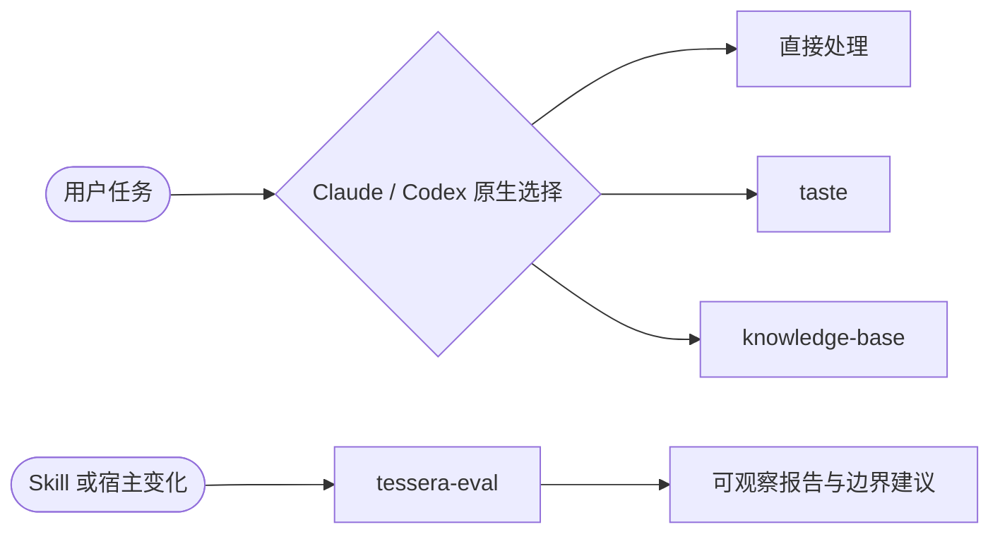

<div align="center">

# 🧩 Tessera

**Claude / Codex 原生 Skills 之上的轻量评测与专业工作流。**

宿主负责 Skill 发现、计划、确认、委派和插件生命周期；Tessera 只验证原生调用，并提供少量可选专业 Skill。

[](https://github.com/gloamere/Tessera/actions/workflows/validate.yml)


</div>

Tessera 是纯 Skills 市集：没有 hooks、常驻进程、数据库、私有任务后端或自建插件管理器。普通任务直接由 Claude/Codex 处理；明确的专业请求由宿主按 Skill description 原生选择。

## 能力

| 插件 | Skill | 用途 | 安装策略 |
|---|---|---|---|
| `tessera-core` | `tessera-eval` | 区分 policy 分类与可观察 native 调用，检查误调、漏调和稳定性 | 核心 |
| `taste` | `taste` | UI、视觉、排版、配色与文案审美评审 | 可选；真实价值评审保留 |
| `knowledge-base` | `knowledge-base` | Markdown + 双链知识沉淀 | 可选；真实价值评审保留 |



## 原生优先边界

以下能力直接使用宿主功能，Tessera 不再包装：

- Skill 发现与调用。
- 会话计划、Goal、用户确认和子代理委派。
- 插件浏览、安装、刷新、启用、禁用与卸载。
- 已安装插件和当前启用状态查看。
- 外部工具、MCP、连接器和浏览器能力选择。

仓库只在 CI 中检查 Claude/Codex marketplace、manifest 和 Skill frontmatter 是否一致；不会在用户会话中维护第二份运行时能力目录。

## 安装

### Codex

Windows 一键安装核心插件：

```powershell
irm https://raw.githubusercontent.com/gloamere/Tessera/main/install.ps1 | iex
```

安装全部三个插件：

```powershell
& ([scriptblock]::Create((irm https://raw.githubusercontent.com/gloamere/Tessera/main/install.ps1))) -All
```

macOS / Linux：

```bash
curl -fsSL https://raw.githubusercontent.com/gloamere/Tessera/main/install.sh | sh
curl -fsSL https://raw.githubusercontent.com/gloamere/Tessera/main/install.sh | sh -s -- --all
```

脚本只调用 Codex 原生 marketplace/plugin 命令并验证安装结果。若不希望执行远程脚本，可手动运行：

```powershell
codex plugin marketplace add gloamere/Tessera --ref main
codex plugin add tessera-core@tessera
codex plugin list --json
```

无需 clone Tessera 仓库。安装后新开任务；插件启停与卸载使用 Codex 原生插件浏览器或 `codex plugin` 命令。

### Claude Code

```powershell
claude plugin marketplace add gloamere/Tessera
claude plugin install tessera-core@tessera --scope user
claude plugin list --json
```

按需安装 `taste@tessera` 或 `knowledge-base@tessera`。交互会话中安装或启停后运行 `/reload-plugins`；其它生命周期动作使用 Claude 原生 `/plugin` 或 `claude plugin` 命令。

## Eval

安装后直接说“运行 tessera eval”或“用个人场景复测原生 Skill 调用”。`tessera-eval` 会从自身插件目录加载运行器、schema 和案例，报告写入当前项目的 `eval-results/`。不需要 Tessera checkout 或 pip；运行 eval 的机器只需能调用 Python 3 标准库。

报告严格区分：

- `verified`：宿主事件或可信 transcript 观察到调用。
- `declared-only`：只有模型自报，不算真实调用通过。
- `unobservable`：没有足够证据。
- `conflict`：模型声明与宿主证据冲突。

Claude 没有可信适配器时只支持 dry-run，并报告 `unavailable`；CI 假宿主只验证脚本和 schema，不作为模型准确率。

## 开发验证

```powershell
python -m pip install -r requirements-dev.txt
./scripts/check.ps1
```

macOS / Linux 使用 `sh scripts/check.sh`。完整检查会验证双宿主发布物、运行单元测试、执行 fixture eval，并确认个人场景 native 计划可生成。

真实 Codex native eval 不进入普通 CI，因为 fixture、dry-run 和模型自报都不能替代已安装插件环境中的宿主事件。维护者在已登录 Codex CLI、已安装目标插件的新环境中手动运行：

```powershell
./scripts/run_native_eval.ps1
```

macOS / Linux 使用 `sh scripts/run_native_eval.sh`。报告默认写入 `eval-results/codex-native.json`。

分发版本以根目录 `VERSION` 为事实来源；推送同名 `v<version>` tag 时，发布工作流会先运行完整检查，再生成 GitHub Release。

## 从 0.4 迁移

0.5 删除了 `piece-router`、`tessera-setup`、`tessera-status`、`tessera-capabilities` 和 `tessera-doctor`，也删除了指令式本地 usage events；0.6 将 eval 运行器、案例和 schema 收入插件安装包，并提供一键安装器；0.7 根据真实质量评审移除 `planner`，产品与活动策划回归宿主原生能力。替代方式：

| 旧入口 | 替代方式 |
|---|---|
| router / recipe / 子代理规则 | 宿主原生计划、Goal、确认与委派 |
| setup | 宿主原生插件管理器和 CLI |
| status / capabilities | 宿主原生插件列表和插件浏览器 |
| doctor / remediation | 宿主诊断；Tessera 仓库结构由 `validate_marketplace.py` 检查 |
| usage events | native eval 报告与人工维护的代表案例 |

已有 `~/.tessera` 数据不会被代码主动删除；不再需要时由用户自行备份或清理。

详见 [部署手册](docs/DEPLOYMENT.md)、[当前运行时架构](docs/decisions/current-runtime-architecture.md) 与 [专业 Skill 组合决策](docs/decisions/professional-skill-portfolio.md)。历史演进仍保留在已标记 `superseded` 的 ADR 中。

## 许可

[MIT](LICENSE) © 2026 gloamere
