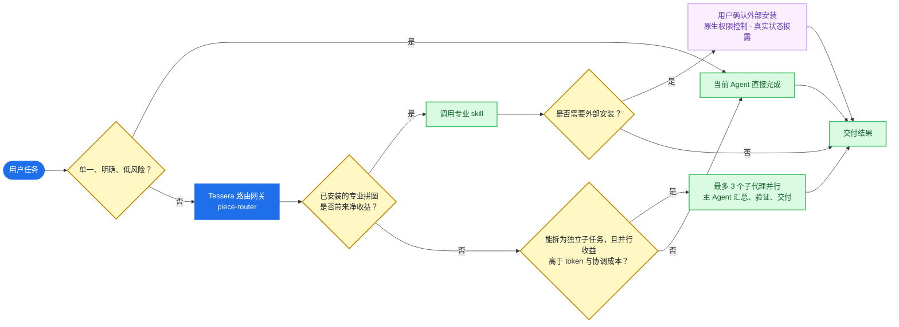

<div align="center">

# 🧩 Tessera

**面向 Codex 与 Claude Code 的本地能力路由网关。**

把可复用能力组织成按需安装的「拼图（pieces）」：简单任务直接完成，明确的专业任务交给对应拼图，复杂任务才进行路由、拆分和条件式并行。

[](https://github.com/gloamere/Tessera/actions/workflows/validate.yml)


</div>

Tessera 是纯 skills 插件：没有 hooks、没有常驻进程、没有 Go/Node 二进制，也不下载 release。安装只需要 Git 与目标客户端的插件 CLI。

## 执行流程



## 适用场景

- 新项目、重构或跨领域需求：先判断该规划、调研、拆分还是直接实施。
- 明确的 UI/视觉改动：在收益足够时调用 `taste`，而不是为小改动增加路由开销。
- 游戏、内容和产品方案：用 `planner` 形成可评审、可拍板的方向。
- 陌生大型代码库：使用宿主已有的检索与代码导航能力，避免为路由额外引入重型服务。

## 默认拼图

“默认提供”不等于静默安装。除 `tessera-core` 外，其余拼图都由用户按需安装。

| 拼图 | 类型 | 用途 | 额外条件 |
|---|---|---|---|
| `tessera-core` | Skills | 路由与解释、安装引导、状态、升级建议、只读诊断 | 无 |
| `taste` | Skill | UI、视觉、排版与文案评审 | 无 |
| `knowledge-base` | Skill | Markdown 知识沉淀与检索 | 无 |
| `planner` | Skill | 游戏、内容、产品方案策划 | 无 |

外部候选（例如 Playwright MCP、GitHub MCP）只在安装方式验证并经用户确认后才进入工作流；未安装、未验证或未集成的能力会如实说明，不会伪装成可调用工具。

## 安装（Codex）

```powershell
git clone https://github.com/gloamere/Tessera.git
cd Tessera
codex plugin marketplace add ./
codex plugin add tessera-core@tessera
codex plugin list
```

新开 Codex 会话后，直接用自然语言触发：

- “不知道该用哪个工具，帮我规划新项目” → `piece-router`
- “查看拼图和依赖状态”或“tessera status” → `tessera-status`
- “安装拼图 / setup” → `tessera-setup`
- “新增一个拼图” → `piece-router` 按七级准入量表先评分再建议
- “全面体检 Tessera / tessera doctor” → `tessera-doctor`

Claude Code 使用同一仓库的 `.claude-plugin/marketplace.json`，但需执行其自身的插件安装命令。

## 功能边界

| 功能 | 行为 |
|---|---|
| 任务路由 | 在直接执行、专业拼图、条件式子代理和透明降级之间选择 |
| 专业能力调用 | 仅当质量/速度收益高于额外 token 与等待成本时调用 |
| 条件式子代理 | 宿主支持且任务独立时，最多并行 3 个；主 Agent 负责汇总与验证 |
| 拼图安装 | 展示选项与依赖；外部安装始终由用户确认 |
| 状态诊断 | 汇总插件版本、启用状态和外部依赖状态 |
| 全面体检 | 只读检查市集、manifest、版本、registry/trust 与依赖漂移 |
| 升级建议 | 区分 current、refresh、update、ahead、unknown；只建议，不自动执行 |
| 路由解释 | router 被调用时说明选择、净收益依据与降级方式 |
| 任务规划 | 使用宿主原生能力，不引入外部持久任务后端 |

## 开发与验证

本项目的产品面是插件清单与 Markdown skills。提交前运行：

```powershell
codex plugin marketplace add ./
codex plugin add tessera-core@tessera
codex plugin list
codex debug prompt-input
```

验证应在新会话中进行，以确认 skill 实际被加载。详见 [部署手册](docs/DEPLOYMENT.md) 与 [第一阶段边界](docs/decisions/phase-1-scope.md)。

## 许可

[MIT](LICENSE) © 2026 gloamere
