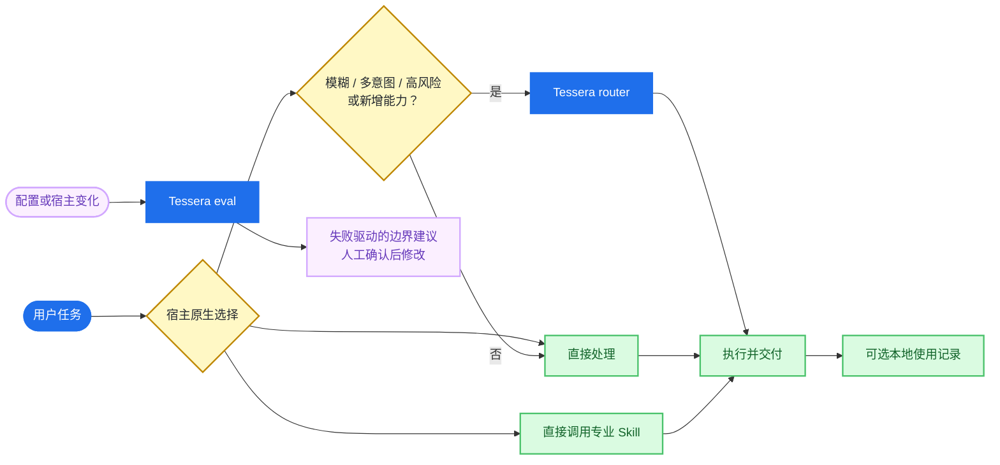

<div align="center">

# 🧩 Tessera

**Claude / Codex 原生 Skills 之上的个人可靠性控制层。**

让宿主原生完成普通 Skill 发现与调用；Tessera 负责调用验证、跨宿主诊断和数据驱动精简。明确任务直接交给宿主，只有模糊、多意图、高风险或新增能力请求才进入 Tessera router。

[](https://github.com/gloamere/Tessera/actions/workflows/validate.yml)


</div>

Tessera 是纯 skills 插件：没有 hooks、常驻进程、Go/Node 二进制或 release 下载链。可选使用记录默认关闭；显式启用后只写入本机 `~/.tessera`，不联网，也不记录提示正文和真实项目路径。

## 当前主线

Tessera 先服务维护者自己的“开发为主、产品/调研/UI/知识为辅”工作流，不以商业化、stars、公共 Benchmark 或拼图数量为目标。

- **Eval**：区分路由政策分类与可观测的原生 Skill 调用，用真实失败驱动边界优化。
- **Status / Doctor**：统一查看 Codex / Claude 的版本、启用状态、配置漂移和个人使用摘要。
- **Router**：只处理模糊、多意图、高风险、不可逆决策和新能力准入。
- **本地使用记录（可选）**：用 30/90 天数据决定保留、修正或卸载哪些能力。

`setup`、生命周期、remediation、marketplace 与 trust 是低频维护层，保持安全可用但不继续扩张。七级准入量表和 recipe 保留为按需参考，不作为日常仪式。

## 执行流程



## 适用场景

- 新项目、高影响重构或跨领域需求：`piece-router` 负责选择工作方式和确认方向。
- 明确的 UI/视觉评审：宿主直接调用 `taste`，不先经过 Tessera router。
- 明确的游戏、内容和产品方案：宿主直接调用 `planner`；知识沉淀同理由宿主直接调用 `knowledge-base`。
- 陌生大型代码库：使用宿主已有的检索与代码导航能力，避免为路由额外引入重型服务。

## 默认拼图

“默认提供”不等于静默安装。除 `tessera-core` 外，其余拼图都由用户按需安装。

| 拼图 | 类型 | 用途 | 额外条件 |
|---|---|---|---|
| `tessera-core` | Skills | 原生调用验证、状态/诊断和异常路由；附带冻结的生命周期与准入能力 | 无 |
| `taste` | Skill | UI、视觉、排版与文案评审 | 无 |
| `knowledge-base` | Skill | Markdown 知识沉淀与检索 | 无 |
| `planner` | Skill | 游戏、内容、产品方案策划 | 无 |

外部候选（例如 Playwright MCP、GitHub MCP）只在安装方式验证并经用户确认后才进入工作流；未安装、未验证或未集成的能力会如实说明，不会伪装成可调用工具。

## 安装（Codex）

```powershell
git clone https://github.com/gloamere/Tessera.git
cd Tessera
codex plugin marketplace add ./
codex plugin add tessera-core@tessera
codex plugin list
```

新开 Codex 会话后，三个主要入口按价值排序是：

- “运行 tessera eval，复测原生 Skill 调用” → `tessera-eval`
- “查看拼图和依赖状态”或“tessera status” → `tessera-status`
- “全面体检 Tessera / tessera doctor” → `tessera-doctor`；明确要求修复时逐项确认 remediation
- “不知道该用哪个工具，帮我规划新项目” → `piece-router`

低频维护仍可使用“安装/升级/禁用/卸载/回滚指导”触发 `tessera-setup`。`tessera-capabilities` 保留为完整能力目录的兼容入口，日常查看已经并入 status。

## 可选本地使用记录

```powershell
# 显式启用；默认保留 90 天
python scripts/usage_events.py enable

# 查看最近 30 或 90 天摘要
python scripts/usage_events.py summary --days 30

# 停止新增记录但保留历史；清空必须显式 purge
python scripts/usage_events.py disable
python scripts/usage_events.py purge
```

事件只包含 skill、宿主、时间、完成状态、显式有用性反馈和带本机 salt 的项目哈希。记录依赖首方 Skill 执行 start/finish 指令，是 best-effort 而不是宿主级完整遥测；外部 Skill 的直接调用无法可靠观测，摘要会明确披露这一边界。

Claude Code 使用同一仓库的 `.claude-plugin/marketplace.json`，但需执行其自身的插件安装命令。

## 功能边界

| 功能 | 行为 |
|---|---|
| 原生调用 | 普通任务由 Claude/Codex 根据 Skill description 原生发现与调用，Tessera 不增加前置网关 |
| 异常路由 | 只为模糊、多意图、高风险、不可逆决策和新能力请求选择工作方式 |
| 动态能力解析 | schema v2 合并会话、市集、piece、skill、registry/trust 与宿主 JSON 探测；status 默认 quick，详细模式才显示候选与未验证项 |
| 专业能力调用 | 仅当质量/速度收益高于额外 token 与等待成本时调用 |
| 条件式子代理 | 宿主支持且任务独立时，最多并行 3 个；主 Agent 负责汇总与验证 |
| 拼图生命周期 | 安装、刷新/升级、启停和卸载逐项确认；回滚只接受显式 Git ref 并保持 plan-only |
| 状态诊断 | 汇总插件版本、启用状态、宿主可用动作和外部依赖状态 |
| 全面体检 | 默认只读；显式 remediation 仅执行 setup 白名单动作并逐项复查 |
| 多意图 recipe | 按数据依赖排序、使用统一交接包，失败只阻断依赖链且不持久化状态 |
| 政策评测 | 用显式分类提示验证 Tessera 路由政策；结果不冒充宿主原生调用证据 |
| 原生调用评测 | 不泄露路由清单，从宿主事件或可信 transcript 观察 Skill；区分 verified、declared-only、unobservable、conflict |
| 提示边界优化 | 同一真实失败至少三次中复现两次才给建议；不自动修改 Skill，也不优化用户日常提示词 |
| 个人场景回归 | 独立维护 25 个案例：15 个开发、10 个产品/调研/UI/知识场景 |
| 本地使用记录 | 默认关闭；启用后本地记录首方 skill 的触发、完成、反馈与跨项目复用，不联网 |
| 升级建议 | 区分 current、refresh、update、ahead、unknown；变更统一交给 setup 逐项确认 |
| 路由解释 | router 被调用时说明选择、净收益依据与降级方式 |
| 任务规划 | 使用宿主原生能力，不引入外部持久任务后端 |

## 开发与验证

本项目的产品面是插件清单与 Markdown skills。提交前运行：

```powershell
python scripts/validate_marketplace.py
python scripts/resolve_capabilities.py --host codex --probe --view quick --format table
python scripts/run_routing_eval.py --host codex --mode policy --dry-run
python scripts/run_routing_eval.py --host codex --mode native --cases tests/personal-routing-cases.yaml --dry-run
python scripts/run_routing_eval.py --host codex --mode native --case visual-review --repeat 3 --suggest-tuning
python -m unittest discover -s tests -p 'test_*.py'
codex plugin marketplace add ./
codex plugin add tessera-core@tessera
codex plugin list
codex debug prompt-input
```

`policy` 只证明路由政策分类；只有 `native` 中带宿主事件或可信 transcript 的 `verified` 才算可观测调用证据。Claude CLI/适配器不可用时只验证结构与 dry-run，不得把假宿主结果描述成 Claude 实测。详见 [部署手册](docs/DEPLOYMENT.md)、[个人工作流主线](docs/decisions/personal-workflow-mainline.md) 与 [原生路由优先决策](docs/decisions/native-routing-reliability-layer.md)。

## 许可

[MIT](LICENSE) © 2026 gloamere
