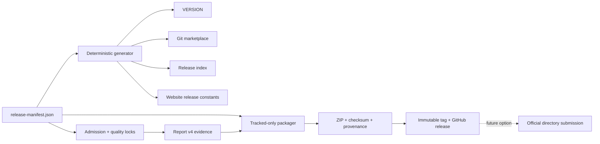

# Current Gloamere architecture

The accepted
[Git marketplace distribution decision](decisions/git-marketplace-v4-release.md)
defines the active 4.0 product boundary. Earlier ADRs remain historical.

## Product surfaces

| Module | Audience | Runtime boundary |
| --- | --- | --- |
| `gloamere-workflows@1.0.0` | Product and design leads | Three skills-only workflows; no MCP, UI, backend, auth, hooks, or telemetry |
| `gloamere-eval@1.0.0-beta.1` | Maintainers | Self-contained Python standard-library runner and local reports |
| `experiments/` | Maintainers | UI System, Debug Loop, and other unpublished candidates; never packaged |
| Host capabilities | End users | Native Skill selection, task execution, approvals, tools, connectors, and plugin lifecycle |

The repository marketplace package contains exactly:

```text
gloamere-workflows
├── gloamere-product-decision
├── gloamere-visual-review
└── gloamere-knowledge-capture
```

Eval remains in the repository marketplace so maintainers can validate the
installed package without making Eval the ordinary user's entry point.

## Release data flow



`release-manifest.json` owns distribution and package versions, statuses,
profiles, skill sets, archive names, admission policy, budgets, thresholds, and
current content hashes. Generated mirrors are checked in CI.

The packager reads the Git index, accepts only regular `100644`/`100755` blobs,
and rejects dirty tracked release files. Each ZIP embeds file hashes, modes,
the commit, and a normalized content digest. A global
`release-provenance.json` binds those digests to archive hashes and release
metadata.

## Evaluation flow

```text
static validation (0 calls)
       ↓
PR selection (0 or ≤12)
       ↓
release selection (normally 20–28 routing calls)
       ↓ unexpected only
targeted retry (total hard cap 40)
       ↓
report v4 + semantic quality rubric
```

Every attempt is appended to a journal before aggregation. `--resume` skips
completed identities, `--shard` partitions deterministic selections, and
`--finalize` builds a report without invoking a model. A future
official-directory submission may complete one 102-case exhaustive pass and
then retry only anomalies up to the separate 120-call hard cap; the Git
marketplace release and routine changes do not run this path.

## Compatibility and support

The intended repository-marketplace targets are the ChatGPT desktop plugin
surface and Codex CLI. ChatGPT desktop compatibility remains a pre-release
smoke-test requirement, not a current compatibility claim. The release does
not claim self-hosted installation on ChatGPT Work web, Chat, IDE integrations,
or mobile. Eval evidence is currently produced by local Codex CLI only.

Legacy `@tessera` detection is read-only. See [MIGRATION.md](../MIGRATION.md).

## Maintainer rules

1. Change `release-manifest.json`, suites, or policies first, then regenerate
   mirrors and hashes in the same change.
2. Keep public Workflows to the same audience and success metric; new
   experimental Skills require current-SHA value and routing evidence.
3. Never publish a mutable branch or a dirty tracked package.
4. Report v3 may be inspected historically but cannot authorize release.
5. Preserve experimental provenance and user-controlled files.
6. Record a reproducible ChatGPT desktop smoke test against the exact release
   candidate before publishing its immutable tag.
