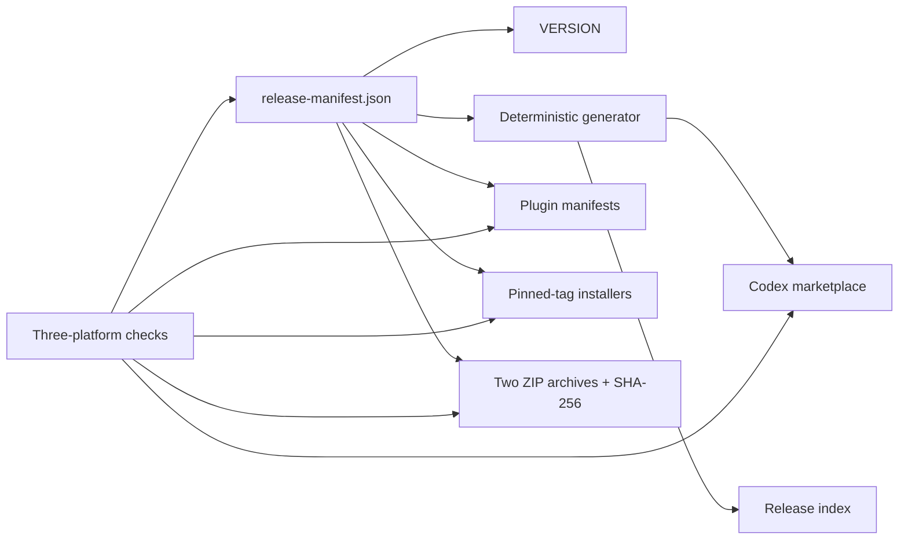

# Current architecture

This page describes the Gloamere 4.x public release. Historical ADRs remain
available as evidence, but only
[codex-only-v4-release](decisions/codex-only-v4-release.md) defines the current
packaging and brand boundary.

## Release surface

| Module | Interface | Runtime boundary |
| --- | --- | --- |
| `gloamere-eval` | `gloamere-skill-eval` and local JSON reports | Self-contained Python 3 standard-library runner; no telemetry or service |
| `gloamere-workflows` | Four independently routed professional skills | Instructions plus bundled local UI reference data and helper scripts |
| Codex native capabilities | Skill selection, plans, approvals, delegation, plugin lifecycle, tools, and connectors | Owned by Codex; Gloamere does not wrap or duplicate them |
| `experiments/` | Maintainer-only evaluation evidence | Not included in plugin manifests or release archives |

The public marketplace exposes exactly two plugins:

```text
gloamere
├── gloamere-eval
└── gloamere-workflows
```

Installing `gloamere-workflows` makes four skill descriptions discoverable. It
does not force all four skills into every task. Codex loads a skill only when
the request matches that skill’s boundary.

## Release seams



`release-manifest.json` is authoritative for the distribution version, Git tag,
repository, marketplace policy, plugin versions, paths, skill sets, archive
names, and legacy detection policy. The generator writes the marketplace and
release index deterministically. Other files are checked mirrors because Codex
and GitHub consume their native formats directly.

Each ZIP contains one top-level plugin directory and its
`.codex-plugin/plugin.json`, `skills/`, assets, references, and helper scripts.
Python caches and repository-only tests or experiments are excluded.

## Compatibility boundary

Gloamere 4.x is Codex-only. It has no active legacy marketplace, manifest, or
installer. When the installer finds a 3.x selector, it reports the manual
migration sequence and stops before changing state. Side-by-side comparison
belongs in a separate `CODEX_HOME`; it is not an accepted routing baseline.
See [MIGRATION.md](../MIGRATION.md) for user-controlled cleanup.

## Maintainer rules

1. Change `release-manifest.json` first, then update all checked mirrors in the
   same change.
2. Do not add a third public plugin without a new accepted ADR and routing
   evidence.
3. Do not publish from a mutable branch. Installer URLs and marketplace Git
   sources must use the release tag.
4. Preserve historical ADRs and evidence verbatim. New architecture replaces
   their authority without rewriting their record.
5. Keep plugin runtime assets self-contained and keep Eval free of third-party
   runtime dependencies.
